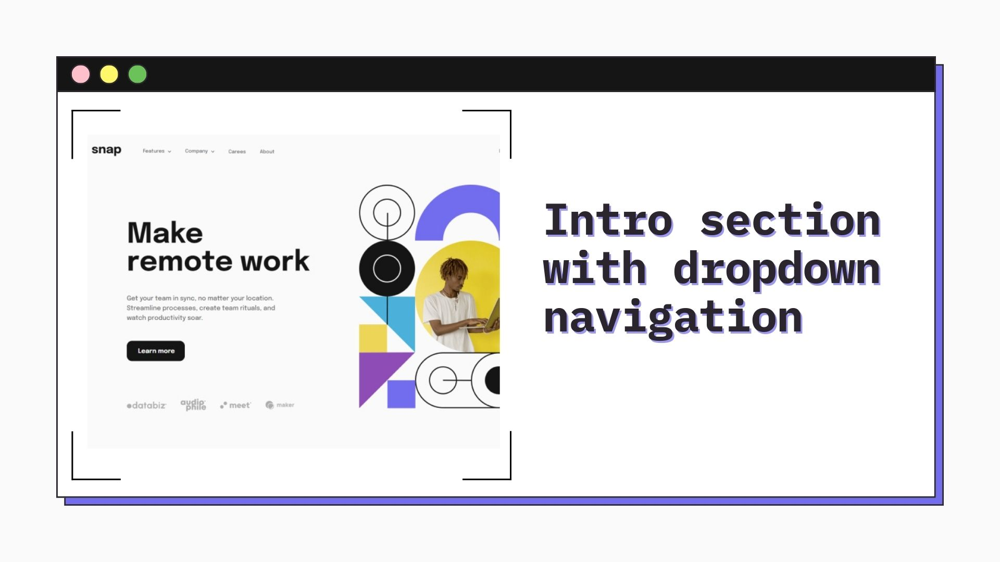
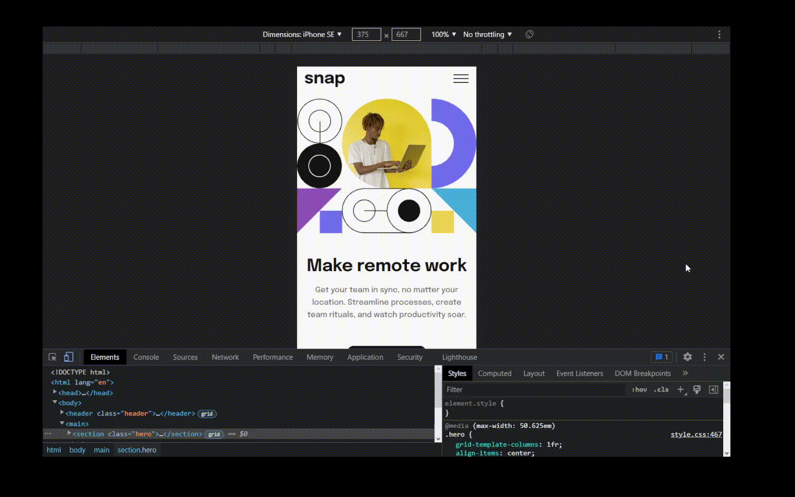

<h1 align="center">Intro section with dropdown navigation
</h1>

&nbsp;



<h2 align="center"> 
	🚧 Intro section with dropdown navigation 🟢 Completed 🚀 🚧
  
</h2>

&nbsp;

<!--
## Table of contents

- [Project description](#description) - [What I learned](#What-I-learned) -->

<h2 id="#description">Project description 📚</h2>

This is a solution to the challenge
[Intro section with dropdown navigation](https://www.frontendmentor.io/challenges/intro-section-with-dropdown-navigation-ryaPetHE5).

This is a challenge on the Mentor frontend website, where I was able to put into practice my knowledge with DOM manipulation, mobile menu, bubble, and dropdown menu.

<a href="https://www.frontendmentor.io/challenges?difficulties=4"></a>

&nbsp;

## What I learned

In this project I focused a lot on creating the Mobile and Dropdown menu, and reviewed my knowledge with bubble which is a type of event control

I also created this function called clickOutside it will make the bubble effect and when the user clicks outside the dropdown menu, it will be closed, we can see in this gif:



<h3>Function:</h3>

```js
function clickOutside(element, events, callback) {
  const html = document.querySelector("html");
  const outside = "data-outside";

  if (!element.hasAttribute(outside)) {
    setTimeout(() => {
      html.addEventListener(events, handleOutsideClick);
    });
    element.setAttribute(outside, "");
  }
  function handleOutsideClick(event) {
    if (!element.contains(event.target)) {
      element.removeAttribute(outside);
      setTimeout(() => {
        html.removeEventListener(events, handleOutsideClick);
      });
      callback();
    }
  }
}
```

## Links

- [Preview Site](https://vinicius-intro-section.netlify.app)
<!-- - [Frontend Mentor Solution Page](https://www.frontendmentor.io/solutions/challenge-completed-with-htmlcssleaflet-jsgrid-and-responsive--kw3kKedNp) -->

&nbsp;

## My process

### Built with

- [HTML](https://developer.mozilla.org/en-US/docs/Web/HTML)
- [CSS](https://developer.mozilla.org/en-US/docs/Web/CSS)
- [JS](https://developer.mozilla.org/en-US/docs/Web/JavaScript)

&nbsp;

## 👨‍💻 Author

- [Frontend Mentor](https://www.frontendmentor.io/profile/viniciusshenri96)
- [Linkedin](https://www.linkedin.com/in/vinícius-henrique-7a2533229/)
